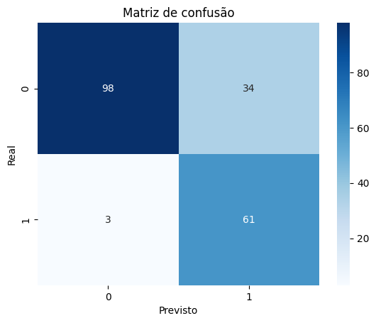
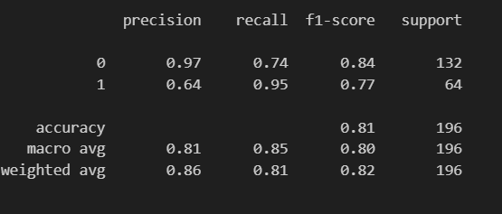

# 🌊 Previsão de Tsunamis com Machine Learning

Projeto de Machine Learning desenvolvido para prever se um **sismo pode gerar um tsunami**, utilizando dados sísmicos e diferentes algoritmos de classificação.

O projeto compara **modelos com normalização e sem normalização**, avaliando o impacto do pré-processamento nos resultados.

---

# Dataset

O dataset contém informações sobre **terramotos registados** e se estes geraram ou não um tsunami.

Variáveis utilizadas:

- magnitude
- cdi
- mmi
- sig
- nst
- dmin
- gap
- depth
- latitude
- longitude

Variável alvo: tsunami

- **0** → Não gerou tsunami  
- **1** → Gerou tsunami  

---

# Modelos de Machine Learning

Foram testados vários modelos de classificação:

### Modelos com normalização
- Logistic Regression
- Support Vector Machine (SVC)

### Modelos sem normalização
- Random Forest
- Decision Tree
- Gradient Boosting

A normalização foi feita com: RobustScaler

---

# Processamento de Dados

Etapas realizadas no projeto:

1. Análise exploratória dos dados
2. Detecção de outliers com **boxplots**
3. Divisão do dataset em **treino e teste**
4. Normalização dos dados
5. Otimização de hiperparâmetros com **GridSearchCV**
6. Validação cruzada (**Cross Validation**)

---

# Avaliação do Modelo

Métricas utilizadas:

- Accuracy
- Precision
- Recall
- F1-score
- Confusion Matrix

### Matriz de Confusão

---

# Classification Report

---

# Aplicação Interativa (Streamlit)

Foi desenvolvida uma aplicação interativa com **Streamlit** que permite inserir manualmente os parâmetros de um sismo e obter a previsão do modelo.

Exemplo da interface:

A aplicação permite:

- Introduzir dados do sismo
- Prever se existe risco de tsunami
- Visualizar a probabilidade da previsão

---

# Estrutura do Projeto
Previsao_Tsunami_StreamLit
│
├── data
│ └── earthquake_data_tsunami.csv
│
├── models
│ ├── modelo_tsunami_normalizado.pkl
│ └── modelo_tsunami_nao_normalizado.pkl
│
├── Images
│ ├── StreamLit.png
│ ├── Matriz_confusao_SVC.png
│ └── classification_report.png
│
├── tsunami_normalizado_LR_SVC.ipynb
├── tsunami_RFC_GBC_DTC.ipynb
│
├── streamlit_modelo_SVC.py
├── streamlit_modelo_RForestClass.py
│
├── requirements.txt
└── README.md

---

# Como Executar o Projeto

### 1️⃣ Clonar o repositório
git clone https://github.com/FranciscoG08/Previsao_Tsunami_StreamLit.git
### 2️⃣ Instalar dependências
pip install -r requirements.txt
### 3️⃣ Executar aplicação Streamlit
streamlit run streamlit_modelo_SVC.py

---

# Tecnologias Utilizadas

- Python
- Pandas
- Scikit-learn
- Matplotlib
- Seaborn
- Streamlit
- Joblib

---

# Objetivo do Projeto

O objetivo deste projeto é:

- Aplicar técnicas de **Machine Learning em dados sísmicos**
- Comparar diferentes algoritmos de classificação
- Avaliar o impacto da **normalização dos dados**
- Desenvolver uma **aplicação interativa para previsão**

---

# Autor

**Francisco Guedes**